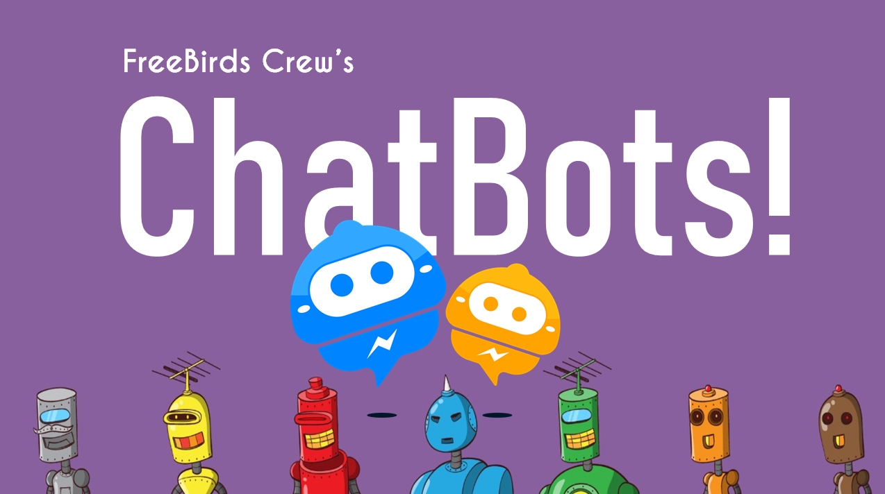

# AI_ChatBot_Python
AI ChatBot using Python Tensorflow and Natural Language Processing (NLP) along side TFLearn
Hey Guys!! Want to Learn about ChatBots? So the Solution is Here.

We Explain about these Topics in Our Tutorial Visit - Youtube -https://www.youtube.com/channel/UC4RZP6hNT5gMlWCm0NDzUWg?view_as=subscriber?sub_confirmation=1
1. What are ChatBots?
2. What ChatBots Can Do?
3. Architecture and Working of ChatBots
4. Core Processes of ChatBots
5. Use Cases of ChatBots
6. Top Healthcare ChatBots
7. Top Companies that Implement ChatBots in Their Business.
8. Top Platforms to Build ChatBots and Tools used in ChatBot Development.
9. Practical Work - Build One Contextual ChatBot Using Python, Tensorflow, and NLP.

